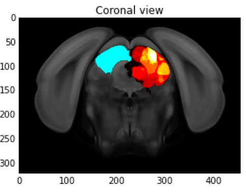
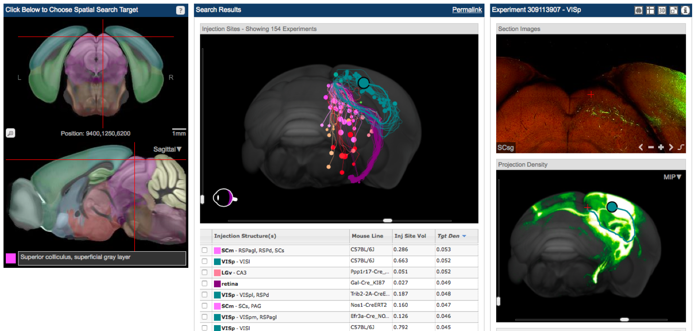
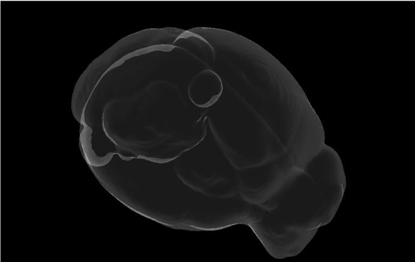
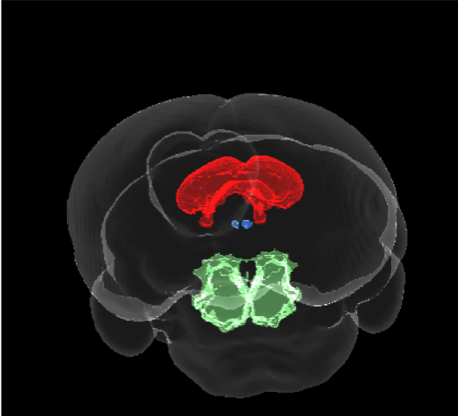

# vis3DConnect
### A Python toolset for 3D visualization of brain connectivity data.

This was a project I completed during the [2016 Summer Workshop on the Dynamic Brain with the Allen Institute](https://www.youtube.com/watch?v=OmYkj1FImpI&ab_channel=AllenInstitute). 

**Vis3DConnect** is an extension to the [Allen Institute python SDK](https://allensdk.readthedocs.io/en/latest/). It allows the user to select neural tracing experiments from the [Mouse Brain Connectivity Atlas] (http://connectivity.brain-map.org/) 
and visualize them in a 3D glass brain with an interface that allows rotation, zooming, etc. I won the prize for "Best Visualization."  

I wrote this code 2 weeks after my first formal lesson in Python. :)

## Narrative

Like many projects, this one involved a pivot. 

I'm interested in eye movements, so I started with the idea of using the Allen Institute connectivity database to map out which cells in the superior colliculus receive the most input from visual cortex cells in mice. Using the Python SDK provided by the Allen Institute, I rendered the image below, which shows a blue mask over the left superior colliculus, and in the right superior colliculus it shows a heat map indicating the amount of overlap of labeled cell bodies at the endpoint of all the tracer injection experiments in the right visual cortex. In other words, when you inject the cell tracer (green flourescent protein, in this case) into the different parts of the right visual cortex of a mouse, you will see most of the projections end up in the regions that are yellow/white.

I felt like I needed more control over the visualizations if I was going to sift through the hundreds of experiments in the Connectivity database. In 2016, the Allen Institute had online tools to interact with a 3D brain (see middle and lower right panels below). However, developers and researchers working with the Allen Institute Python SDK didn't have access to any such functionality; if they wanted rich visual interaction with volumes instead of flattened 2D projections, they needed to switch back and forth between the SDK and the web interface.  

I decided to change directions and focus on extending the visualization functionality of the SDK by providing some methods for pulling connectivity pathways and labeling expression volumes from the database, and then visualizing them in a glass brain that allows for zooming and 3D rotation. 

## Methods

### * glass_brain()

This, not surprisingly, renders a blank glass brain.

### * structure_mask()

The `structure_mask()` method renders glass volumes of neuroanatomical structures within the glass brain. In the image below, I've rendered a trio of important oculomotor regions: the superior colliculus (red), the caudal pontine reticular nucleus (green), and the oculomotor nucleus (blue). 

### * get\_path() and show\_path()

These two methods make it easier for the user to query for connectivity pathways inferred from projection tracing experiments, and then visualize those projections within the glass brain. Check out the video below, which shows a projection from visual cortex (pink) to superior colliculus (green).

<!--<video width="450" controls>
  <source src="./assets/vid1.mp4" type="video/mp4">
</video>-->

### * projections()

The `projections()` method renders volumes of the raw tracing experiment results. You can render an arbitrary number of experiments simultaneously. For example, in the video below there are two experiments. The blue represents all of the cells that expressed the tracing indicator after it was injected into superior colliculus. The red represents the cells that expressed the indicator after an injection into pontine reticular formation. The purple is the overlap between the two.
 
<!--<video width="450" controls>
  <source src="./assets/vid2.mp4" type="video/mp4">
</video>-->

## NOTES

This was developed using python 2.

To speed up development, this code was originally written to pull data from an external hard drive instead of from the online database at the Allen Institute. If someone wanted to clone this repo and play with the code, they would have to set up the source to be the online database first.

